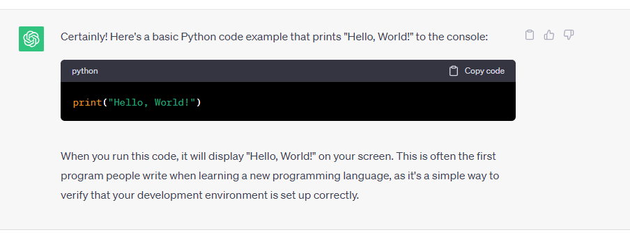

# Writing good documentation
## 1. Using codeblocks 
It important to write codeblocks in order to see the code we are working on, copy or review our code. 
Get in the habit of using codeblocks on your documentation. [^1]

**This is a Python example:**
```python
import requests
from bs4 import BeautifulSoup

# URL of the website to scrape
url = "https://example-news-website.com"

# Send an HTTP GET request to the website
response = requests.get(url)

# Check if the request was successful (status code 200)
if response.status_code == 200:
    # Parse the HTML content of the page using BeautifulSoup
    soup = BeautifulSoup(response.text, 'html.parser')
    
    # Find and extract the titles of articles
    article_titles = soup.find_all('h2', class_='article-title')
    
    # Print the extracted article titles
    for title in article_titles:
        print(title.text)
else:
    print("Failed to retrieve the web page.")

```
Also, you can use codeblocks for displaying console errors

__This is en python console error__

```bash
Traceback (most recent call last):
  File "example.py", line 2, in <module>
    print(variable_that_does_not_exist)
NameError: name 'variable_that_does_not_exist' is not defined
```

## 2. Include images for ilustration
It's always a good idea to include som images for ilustration so we can understand more about what we are writing



## 3. Github Tasks List
We can use Task list in order to track what tasks we have finish by putting a checkmark.

- [ ] Step One
- [ ] Step Two
- [ ] Step three
- [ ] Step four
- [ ] Final step

## 4. Use emojis whenever you can (optional)

Github GFM supports emojis by using some shortcodes.

Here are some examples:

| Name | Shortcode | Emoji |
| --- | --- | --- |
| Blush | `:blush:`| :blush: |
| Laughing | `:laughing:` | :laughing: |
| Sunglasses | `:sunglasses:` | :sunglasses: |

## References for Markdown Language
- [Getting started with formatting](https://docs.github.com/en/get-started/writing-on-github/getting-started-with-writing-and-formatting-on-github/basic-writing-and-formatting-syntax) 
- [Markdown Guide Cheat sheet](https://www.markdownguide.org/cheat-sheet/)
- [Github Markdown Emoji list](https://dev.to/nikolab/complete-list-of-github-markdown-emoji-markup-5aia)


[^1]: Remember to do proper formatting